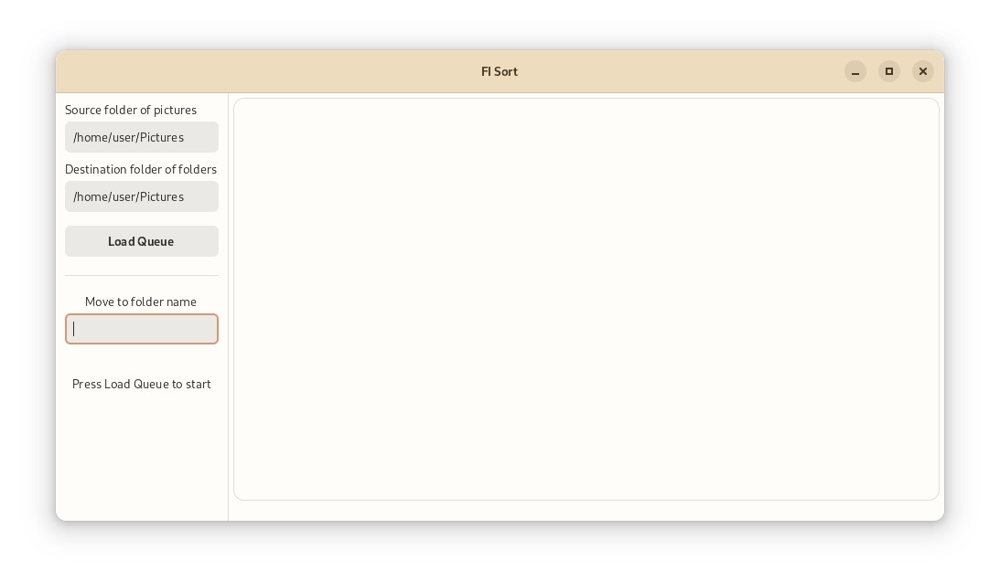

# Folder Image Sorter 2

Sequentially sort your images into subdirectories by giving a folder name.

The sequel to [folder-image-sorter1](https://github.com/Taiko2k/folder-image-sorter) but this time written in GTK(4).

Imagine you have a folder of images, say animal pictures, and you want to sort each type into its own folder. For example; 'dogs' and 'cats', normally you might use your file manager, but if there's many folders to sort into, this may become a little tiresome. This application allows you to queue up images and give each image a folder name to be moved to.

### Downloading

No packages, you'll need to run from source. You will need GTK4 and Libadwaita, if you're on Arch Linux you probably already have these.

`$ git clone https://github.com/Taiko2k/folder-image-sorter2.git`  
`$ cd folder-image-sorter2`  
`$ python3 main.py`

### How to use

1. Select a source directory of images.
2. Select a destination directory to create folders in. (Can be the same as source)
3. Click "Load Queue".
4. In the text entry box below, type the name of a folder to put the image in then press <kbd>Enter</kbd>.
5. Done! It'll then move onto the next file.

### Tips

 - Press <kbd>Del</kbd> to move the item to system Trash.
 - Press <kbd>Left</kbd> / <kbd>Right</kbd> to skip over items in the queue.
 - Press <kbd>Tab</kbd> to autocomplete the folder name to most recent.
 - For speed, use short names or single letters as your folder names. You can rename them in your file manager later.
 - You can only sort into folders in the destination folder one layer deep. (So no `example/example`)
